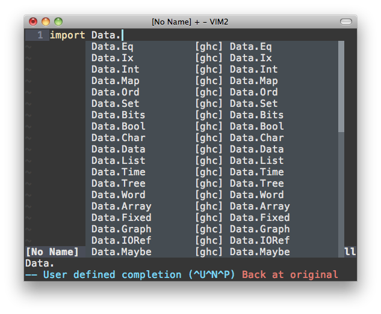

# Vim + Haskell

So you're writing in the right language using the right tool already, but lets
put some extra magic under our leaves.


## Expectations

* Omnicompletion
* Convenient mappings for
    * Building
    * Linting
    * Testing
    * Jump to importations
* Ghc-mod integration
    * Type inserting
    * Case splitting
    * Type asserting
* Code formatting
* Code cleaning
    * Trailing whitespace
    * Trailing blank lines
    * Spaces over tabs
* Easy arrows generation
* Types abbreviations

Most of this functionality is achieved by using already available tools and
already available Vim plugins for those tools. So I'll assume you have your way
to install the plugins (I'm using
[vim-plug](https://github.com/junegunn/vim-plug)).

Here is my complete
[.vimrc](https://github.com/alx741/dotfiles/blob/master/nvim/.config/nvim/init.vim).


**Important**: Every line of vimrc used should be enclosed in an `:h :augroup`:

    augroup ft_haskell
        au!

        ...

    augroup END


### Omnicompletion

The [neco-ghc](https://github.com/eagletmt/neco-ghc) plugin declares a complete
omnifunction. Use it by defining the local `omnifunc`:

    au FileType haskell setlocal omnifunc=necoghc#omnifunc




### Convenient mappings

Using [vim-dispatch](https://github.com/tpope/vim-dispatch),
[neomake](https://github.com/neomake/neomake) and `g` prefixed mappings we can
now build with `gj` ([Stack](https://docs.haskellstack.org/en/stable/README/),
lint with `gl`, and test with `gk`. Also use `gI` to jump to the first *import*.

You will need the Stack tool of course and *hlint* that you can install with
`stack install hlint`.

    au FileType haskell nnoremap <buffer> gl :Neomake<CR>
    au FileType haskell nnoremap <buffer> gj :Make build<CR>
    au FileType haskell nnoremap <buffer> gk :Make test<CR>
    au FileType haskell nnoremap <buffer> gI gg /\cimport<CR><ESC>:noh<CR>


### Ghc-mod integration

[ghc-mod](https://hackage.haskell.org/package/ghc-mod) is the *Happy Haskell
Programming package*! With a whole bunch of functionality, here we will be using
just a few:

* Type inserting
* Case splitting
* Type asserting

You need the *ghc-mod* package: `stack install ghc-mod` and the [ghcmod-vim
plugin](https://github.com/eagletmt/ghcmod-vim).

    au FileType haskell nnoremap <silent><buffer> git :GhcModTypeInsert<CR>
    au FileType haskell nnoremap <silent><buffer> gfs :GhcModSplitFunCase<CR>
    au FileType haskell nnoremap <silent><buffer> gtt :GhcModType<CR>


`git` (*g insert type*) will insert the missing type declaration of an
expression, take for instance this Haskell code:

```haskell
module Hello where

f (Just a) = Left a
f Nothing = Right ()
```

With the cursor in the first `f` (the function name) using the `tt` mapping will
produce:

```haskell
module Hello where

f :: Maybe a -> Either a ()
f (Just a) = Left a
f Nothing = Right ()
```

Neat!, go ahead and play around with the other mappings, you'll be not
disappointed.
