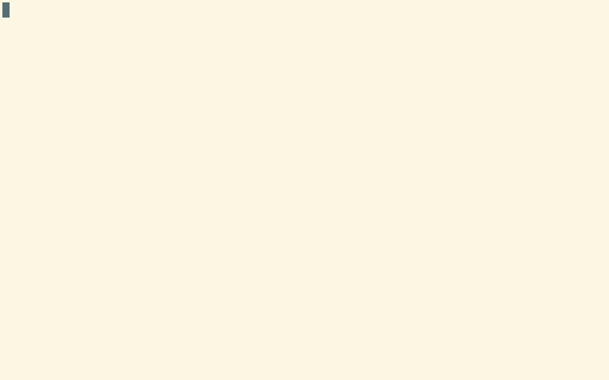

# Vim + Haskell

So you're writing in the right language using the right tool already, but lets
put some extra magic under our sleeves.


## Expectations

* Omnicompletion
* Convenient mappings for
    * Building
    * Linting
    * Testing
    * Jump to importations
* Ghc-mod integration
    * Type inserting
    * Case splitting
    * Type asserting
* Code formatting
* Code cleaning
    * Trailing whitespace
    * Trailing blank lines
    * Spaces over tabs
* Easy arrows generation
* Types abbreviations

Most of this functionality is achieved by using already available tools and
already available Vim plugins for those tools. So I'll assume you have your way
to install the plugins (I'm using
[vim-plug](https://github.com/junegunn/vim-plug)).

Here is my complete
[.vimrc](https://github.com/alx741/dotfiles/blob/master/nvim/.config/nvim/init.vim).


**Important**: Every line of vimrc used should be enclosed in an `:h :augroup`:

    augroup ft_haskell
        au!

        ...

    augroup END


### Omnicompletion

The [neco-ghc](https://github.com/eagletmt/neco-ghc) plugin declares a complete
omnifunction. Use it by defining the local `omnifunc`:

    au FileType haskell setlocal omnifunc=necoghc#omnifunc


### Convenient mappings

Using [vim-dispatch](https://github.com/tpope/vim-dispatch),
[neomake](https://github.com/neomake/neomake) and `g` prefixed mappings we can
now build with `gj` ([Stack](https://docs.haskellstack.org/en/stable/README/),
lint with `gl`, and test with `gk`. Also use `gI` to jump to the first *import*.

You will need the Stack tool of course and *hlint* that you can install with
`stack install hlint`.

    au FileType haskell nnoremap <buffer> gl :Neomake<CR>
    au FileType haskell nnoremap <buffer> gj :Make build<CR>
    au FileType haskell nnoremap <buffer> gk :Make test<CR>
    au FileType haskell nnoremap <buffer> gI gg /\cimport<CR><ESC>:noh<CR>


### Ghc-mod integration

[ghc-mod](https://hackage.haskell.org/package/ghc-mod) is the *Happy Haskell
Programming package*! With a whole bunch of functionality, here we will be using
just a few:

* Type inserting
* Case splitting
* Type asserting

You need the *ghc-mod* package: `stack install ghc-mod` and the [ghcmod-vim
plugin](https://github.com/eagletmt/ghcmod-vim).

    au FileType haskell nnoremap <silent><buffer> git :GhcModTypeInsert<CR>
    au FileType haskell nnoremap <silent><buffer> gfs :GhcModSplitFunCase<CR>
    au FileType haskell nnoremap <silent><buffer> gtt :GhcModType<CR>


`git` (*g insert type*) will insert the missing type declaration of an
expression, take for instance this Haskell code:

```haskell
module Hello where

f (Just a) = Left a
f Nothing = Right ()
```

With the cursor in the first `f` (the function name) using the `tt` mapping will
produce:

```haskell
module Hello where

f :: Maybe a -> Either a ()
f (Just a) = Left a
f Nothing = Right ()
```


Neat!, go ahead and play around with the other mappings, you'll be not
disappointed.


### Code formatting, Code cleaning

Lets define a function that remove trailing white spaces, remove any `tab` and
convert it to `spaces`, do re-indentation, and temporally define `formatprg` to
use [hindent](https://github.com/chrisdone/hindent) to format the code.

You can install *hindent* with stack as well: `stack install hindent`.

    function! Format()
        silent! execute 'norm! mz'

        if &ft ==? 'haskell'
            setlocal formatprg=hindent\ --style\ chris-done
            silent! execute 'norm! gggqG'
        endif

        silent! call RemoveTrailingSpaces()
        silent! execute 'retab'
        silent! execute 'gg=G'
        silent! execute 'norm! `z'
        setlocal formatprg=
    endfunction


Now we could use `g=` to invoke the function:

    nnoremap <silent>g= :call Format()<CR>

One extra thing left is to align stuff in the code so it looks nicer

    au FileType haskell nmap <silent><buffer> g<space> vii<ESC>:silent!'<,'> EasyAlign /->/<CR>

Take for instance this very dumb example for the sake of the argument:

```Haskell
module Test where

f :: Int -> String
f x = case x of
    1   -> "1"
    2 ->   "2"
    3 -> "3"
```

Using `g<space>` we got:

```Haskell
module Test where

f :: Int -> String
f x =
  case x of
    1 -> "1"
    2 -> "2"
    3 -> "3"
```



So much better!


### Easy arrows generation

In Haskell, operators like `->` and `=>` are very common and I find it
cumbersome to type theme manually. Lets define a function:

    function! Make_arrow(type)
        if a:type
            exe "norm! a-> "
            exe "startinsert!"
        else
            exe "norm! a=> "
            exe "startinsert!"
        endif
    endfunction

And some insert mode mappings:

    au FileType haskell inoremap <buffer> ;; <ESC>:call Make_arrow(1)<CR>
    au FileType haskell inoremap <buffer> ;: <ESC>:call Make_arrow(0)<CR>

So while in insert mode typing `;;` or `;:` will insert `->` or `=>`
respectively.


### Types abbreviations

Maybe i'm a terrible typist, but writing the first upper case letter of the most
common types hurst my pinkie. So by using some insert mode abbreviations:

    au FileType haskell inoreab <buffer> int Int
    au FileType haskell inoreab <buffer> integer Integer
    au FileType haskell inoreab <buffer> string String
    au FileType haskell inoreab <buffer> double Double
    au FileType haskell inoreab <buffer> float Float
    au FileType haskell inoreab <buffer> true True
    au FileType haskell inoreab <buffer> false False

Now I can type all lower case without having to bother with the *shift* key and
the capitalized version will be inserted instead.
